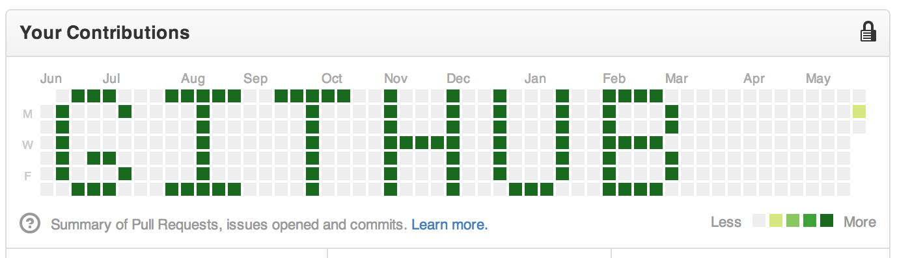

# 🌱 goGreen


With **goGreen**, you can make your GitHub profile look like you've been hard at work... even if you haven't.  
A Node.js script to make commits to the past (or the future) and make your GitHub contribution graph **green**.

## 📜 About

**goGreen** allows you to create commits on your GitHub profile for any date in the past (or future).  
Whether you want to fill up your contribution graph, create cool patterns, or simply impress your friends with your "activity," **goGreen** is the perfect solution.

## 🚀 Getting Started

Follow these steps to bring your contribution graph to life:

### 1. Clone the Repository
```bash
git clone https://github.com/ayoub-ben-99/goGreen.git
cd goGreen
```

### 2. Set Up Your Project
Initialize a new Node.js project:
```bash
npm init -y
```

### 3. Install Required Modules
You'll need a few npm modules to get everything running smoothly. Install them with:
```bash
npm install moment simple-git random colors
```

### 4. Create Your Commit Script
- Create a JavaScript file to manage your commits.
- Create a JSON file to store all the commit timestamp data.

## 🎨 Room for Improvement

Now that you have the basics, what’s next? Here are some ways to take your `goGreen` experience further:

- **Custom Patterns**: Experiment with different patterns on your contribution graph. Maybe spell out your name or create some cool designs!
- **Density Control**: Play around with the number of commits per day to adjust the shades of green on your profile.
- **Input Strings**: Convert input strings to X-Y mapped contributions for a more personalized approach.

## 📦 npm Modules Used

- [`moment`](https://www.npmjs.com/package/moment) - Handles date and time manipulation.
- [`simple-git`](https://www.npmjs.com/package/simple-git) - A simple way to execute Git commands from Node.js.
- [`random`](https://www.npmjs.com/package/random) - Used to generate random numbers for commit scheduling.

## 💡 Future Enhancements

- **Multiple Branches**: Add functionality for creating commits on different branches.
- **More Patterns**: Provide predefined patterns for users to easily generate specific designs.
- **Automated Pushes**: Schedule commits automatically on specific dates.

## 👨‍💻 Contributing

Contributions are always welcome! If you have any suggestions, fixes, or ideas, feel free to open an issue or submit a pull request.

## 📈 Example Contribution Graph

Here's an example of what your contribution graph could look like using **goGreen** :


---

> ### Made with  by : [**ayoub-ben-99**](https://github.com/ayoub-ben-99)

